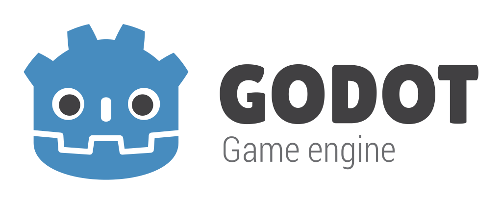

# Godot Engine Melvin 🎮

> **A custom Godot 4.4.1 build with Windows CRLF line ending support**

## 📋 Overview

This is a modified version of **Godot Engine 4.4.1** that generates and preserves **CRLF line endings** on Windows. This build was created to support legacy Windows toolsets and CI systems that require CRLF line endings for proper operation.

## ✨ Features

- ✅ **CRLF Script Generation**: New C# scripts are created with Windows-style line endings
- ✅ **Line Ending Preservation**: Projects maintain CRLF endings during runtime
- ✅ **External Editor Support**: Works seamlessly with VS Code and other external editors
- ⚠️ **Built-in Editor Limitation**: Internal script editor still saves as LF (help wanted!)

## 🚀 Installation

### Step 1: Download
Download the latest release from the [Releases](../../releases) page.  
Rest of the instructions have been given in the [Releases](../../releases) page.

## 🎯 Use Cases

Perfect for teams that:
- Use legacy Windows build scripts requiring CRLF
- Have CI/CD pipelines expecting Windows line endings
- Work with Windows-specific file processing tools
- Need consistent line endings across Windows development environments

## 🐛 Known Issues

- **Built-in script editor** still saves files with LF line endings
- **Windows only** - These modifications are Windows-specific

## 🤝 Contributing

Found a way to fix the built-in editor line ending issue? Contributions welcome! Please open an issue or PR.

## 📄 License

This modified version maintains the same **MIT License** as the original Godot Engine.

## 🙏 Credits

- **Original Godot Engine**: Created by the amazing [Godot community](https://godotengine.org)
- **CRLF Modifications**: Custom patches for Windows line ending compatibility
- **Inspiration**: Built to support legacy Windows development workflows

---

## ⚠️ Disclaimer

- This is an unofficial, modified version of Godot Engine. For official support and the standard engine, please visit [godotengine.org](https://godotengine.org).

- Among the markdown files `CHANGELOG.md`, `README.md` and
  `AUTHORS.md` were edited and are relevant to this repository.
  All other markdown files are for the official Godot Project.

---

### Original Godot Engine README

# Godot Engine

  

## 2D and 3D cross-platform game engine

**[Godot Engine](https://godotengine.org) is a feature-packed, cross-platform
game engine to create 2D and 3D games from a unified interface.** It provides a
comprehensive set of [common tools](https://godotengine.org/features), so that
users can focus on making games without having to reinvent the wheel. Games can
be exported with one click to a number of platforms, including the major desktop
platforms (Linux, macOS, Windows), mobile platforms (Android, iOS), as well as
Web-based platforms and [consoles](https://docs.godotengine.org/en/latest/tutorials/platform/consoles.html).

## Free, open source and community-driven

Godot is completely free and open source under the very permissive [MIT license](https://godotengine.org/license).
No strings attached, no royalties, nothing. The users' games are theirs, down
to the last line of engine code. Godot's development is fully independent and
community-driven, empowering users to help shape their engine to match their
expectations. It is supported by the [Godot Foundation](https://godot.foundation/)
not-for-profit.

Before being open sourced in [February 2014](https://github.com/godotengine/godot/commit/0b806ee0fc9097fa7bda7ac0109191c9c5e0a1ac),
Godot had been developed by [Juan Linietsky](https://github.com/reduz) and
[Ariel Manzur](https://github.com/punto-) (both still maintaining the project)
for several years as an in-house engine, used to publish several work-for-hire
titles.

## Getting the engine

### Binary downloads

Official binaries for the Godot editor and the export templates can be found
[on the Godot website](https://godotengine.org/download).

### Compiling from source

[See the official docs](https://docs.godotengine.org/en/latest/contributing/development/compiling)
for compilation instructions for every supported platform.

## Community and contributing

Godot is not only an engine but an ever-growing community of users and engine
developers. The main community channels are listed [on the homepage](https://godotengine.org/community).

The best way to get in touch with the core engine developers is to join the
[Godot Contributors Chat](https://chat.godotengine.org).

To get started contributing to the project, see the [contributing guide](CONTRIBUTING.md).
This document also includes guidelines for reporting bugs.

## Documentation and demos

The official documentation is hosted on [Read the Docs](https://docs.godotengine.org).
It is maintained by the Godot community in its own [GitHub repository](https://github.com/godotengine/godot-docs).

The [class reference](https://docs.godotengine.org/en/latest/classes/)
is also accessible from the Godot editor.

We also maintain official demos in their own [GitHub repository](https://github.com/godotengine/godot-demo-projects)
as well as a list of [awesome Godot community resources](https://github.com/godotengine/awesome-godot).

There are also a number of other
[learning resources](https://docs.godotengine.org/en/latest/community/tutorials.html)
provided by the community, such as text and video tutorials, demos, etc.
Consult the [community channels](https://godotengine.org/community)
for more information.

